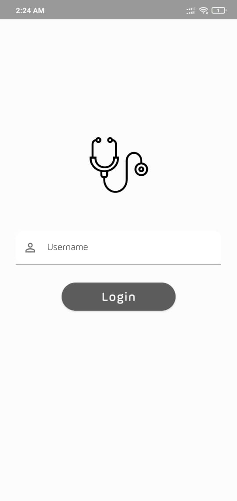
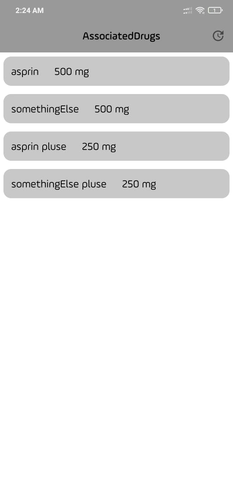
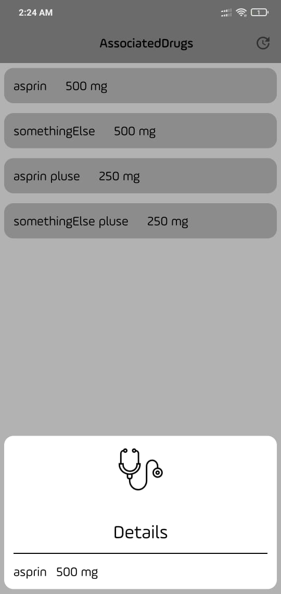

# Android Task  

 
## Requirements
 
*   simple login screen.
*   greet the user based on the time of the day.
*   Show data in recyclerView in Item card.   
*   Save the data for offline usage.
 
 ###### **Tecgnologes uses in it.**
 * Kotlin.
 * xml
 * MVVM Design Pattern
 * Dagger2
 * Room DataBase
 * LiveData
 * Coroutines
 * Retrofit
 * okhttp3
 
  ###### **Tools and IDEs uses.**
* Android Studio

*   **[Download latest debug APK here] (https://github.com/azmiradi/TestApp/blob/master/app-debug.apk)**.

| login | main |
| --------------- | ---------------- | 
|  |  |

| details |
| ---------------- |
|   | 

<!-- Redmi not 6 pro -->
